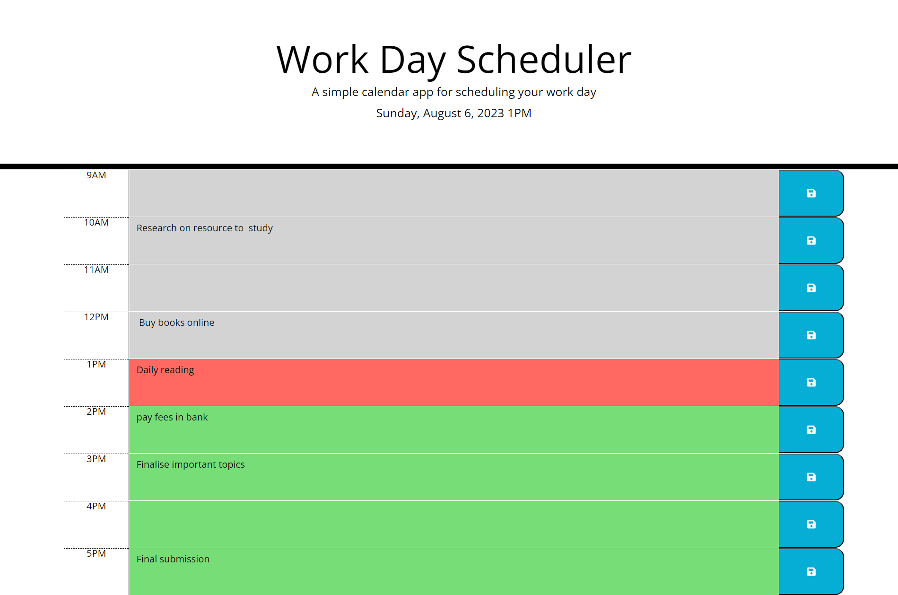

# Third-Party APIs: Daily Planner App


## Description

The Daily Planner App provides an intuitive interface and practical features to help users organize their daily tasks effectively.

With the Daily Planner App's user-friendly interface, color-coded time blocks, and automatic saving of events, you can efficiently plan your day, stay on top of your schedule, and boost your productivity.

## Installation

. Clone the repository to your local machine.

. Open the project directory in your preferred console or code editor.
    
## Features

- Current Day Display: Upon opening the app, the current day and time are prominently displayed at the top of the calendar, ensuring you are always aware of the current date.

- Time Blocks for Business Hours: The app dynamically generates time blocks for standard business hours, starting from 9 AM to 5 PM. Each time block represents an hour and allows you to plan your day in detail.

- Color-Coded Time Blocks: To easily distinguish between past, present, and future events, the time blocks are color-coded. The past time blocks appear in a subdued color, the present time block stands out with a distinct color, and the future time blocks are visually identifiable with another color.

- Add/Update Events: You can click on any time block to add or update an event or task for that specific hour. Simply click into the time block, and a textarea will appear, allowing you to enter the details of the event.

- Save Events to Local Storage: After entering the event details, click the save button represented by a disk icon. The event will be saved into your browser's local storage, ensuring your planned tasks persist even when you close or refresh the page.

- Persistent Saved Events: When you revisit the app or refresh the page, your saved events will be retrieved from local storage and displayed in their respective time blocks. This way, you can continue managing your daily tasks seamlessly.


## Usage/Examples

    > Displays the current day at the top of the calendar

    >  Includes time blocks for standard business hours

    > Each time block is color-coded to indicate whether it is in the past, present, or future

    > The user can click into a time block to add/update an event

    > The user can click the save button and the event is saved into local storage

    > When the user refreshes the page, the saved events persist


## Screenshots




## Lessons Learned

During the development of this project, I learned the following:

API Integration Complexity: Integrating third-party APIs can be challenging, requiring thorough understanding and proper error handling.

User Experience: User feedback is vital for improving the app's usability and identifying pain points.

Security: Ensuring the security of user data, especially when handling API keys and user credentials, is of utmost importance.

Scaling and Performance: As the user base grows, optimizing app performance and scalability becomes crucial.

Documentation: Clear and up-to-date documentation is essential for both developers and end-users.

Continuous Improvement: Embracing continuous improvement and incorporating user feedback is essential to create a successful application.


## Credits

>> Stack Overflow: The Stack Overflow community provided solutions to specific coding challenges and troubleshooting help during the development process.

>> MDN Web Docs: The MDN Web Docs provided invaluable information about JavaScript, the DOM, and many other web development concepts.

 >>Thanks to the contributors of the JavaScript community for their valuable libraries and resources.


## Demo

Insert gif or link to demo


## Run Locally

Clone the project

```bash
  git clone https://link-to-project
```

Go to the project directory

```bash
  cd my-project
```

To open in visual studio

```bash
  code .
```


## License

Please refer to the LICENSE in the repo.

